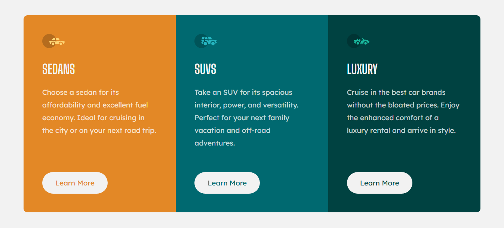
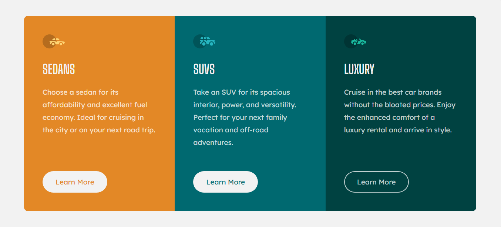

# 3-column-preview-card-component-main
Responsive 3-column preview card component

This is a solution to the [3-column-preview-card-component-main challenge on Frontend Mentor](https://www.frontendmentor.io/challenges/3column-preview-card-component-pH92eAR2-). Frontend Mentor challenges help you improve your coding skills by building realistic projects. 

## Table of contents

- [Overview](#overview)
  - [Screenshot](#screenshot)
  - [Links](#links)
- [My process](#my-process)
  - [Built with](#built-with)
  - [What I learned](#what-i-learned)
  - [Continued development](#continued-development)
- [Author](#author)

## Overview

### Screenshot

These are my screenshots showing how the project turned out.

- Desktop design:



- Mobile design:


- Active state:



### Links

- Solution URL: [My Solution](https://github.com/gillaercio/3-column-preview-card-component-main)

## My process

### Built with

- Semantic HTML5 markup
- CSS custom properties
- Nesting CSS
- Grid Layout
- Mobile-first workflow

### What I learned

I took advantage of this project to practice the use of **nesting css** and **clamp()**:

Nesting CSS

```css
.luxury-model {
  background-color: var(--Very-dark-cyan);
  border-bottom-left-radius: 10px;
  border-bottom-right-radius: 10px;

  .button-car {
    color: var(--Very-dark-cyan);
  }

  .button-car:hover {
    background-color: var(--Very-dark-cyan);
  }
}
```

Resizing fonts with clamp()

```css
.model-car {
  margin-top: 30px;
  font-size: clamp(3rem, 2.8rem + 1.1662vw, 3.4rem);
}

.description-car {
  margin-bottom: 60px;
  font-size: clamp(1.5rem, 1.3rem + 1.1662vw, 1.9rem);
}

.button-car {
  width: 175px;
  font-size: clamp(1.5rem, 1.3rem + 1.1662vw, 1.9rem);
  margin-top: auto;
}
```

### Continued development

I would like to improve the use of the **HTML** and **CSS**.

## Author

- Frontend Mentor - [@gillaercio](https://www.frontendmentor.io/profile/gillaercio)
- Github - [My Github](https://github.com/gillaercio)
- LinkedIn - [My LinkedIn](https://www.linkedin.com/in/gildman-la%C3%A9rcio/)